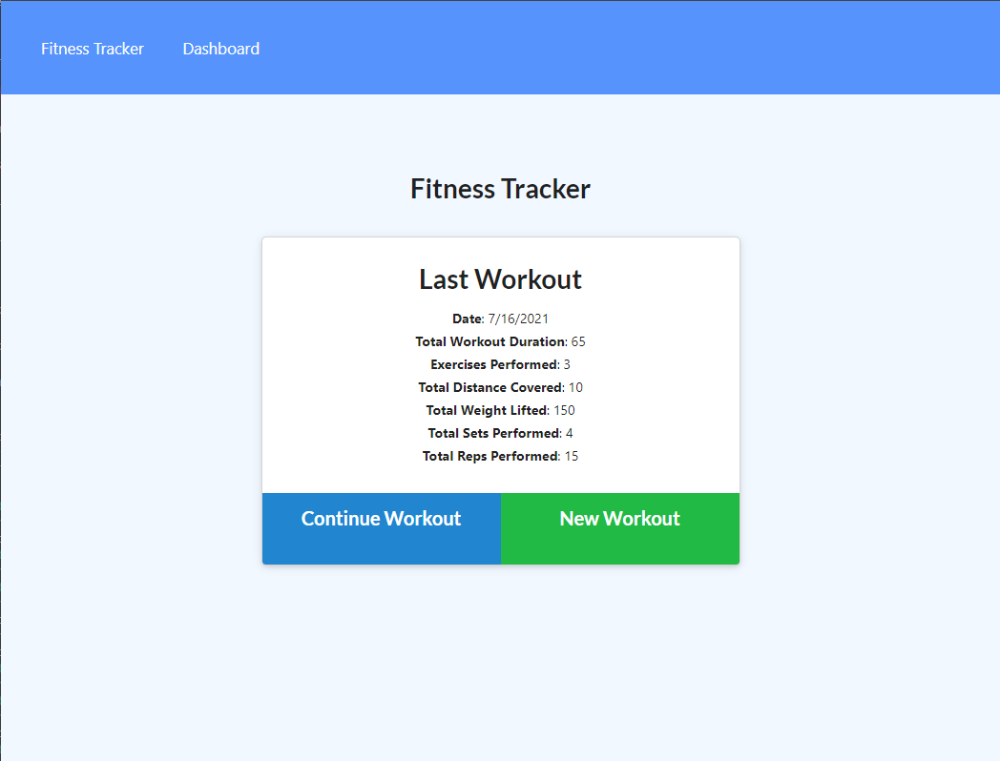
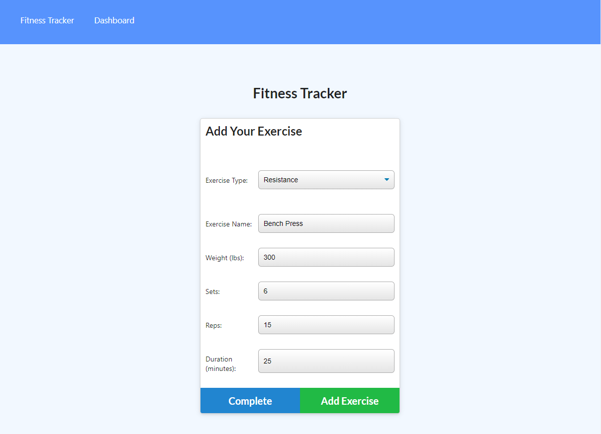
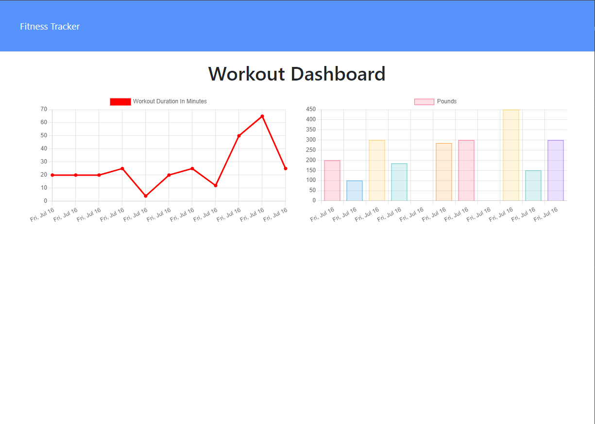

# Workout Tracker

## Descriptions 

A web-based workout tracker application. It allows users to create and track their daily workouts. Users can create daily workouts, add resistance or cardio exercises to their workout. The application can combine exercises data and display them as graphical charts. The back end of this application was created with Mongo database, Mongoose schema, and Express.

## Table of contents
- [Installation](#installation)
  
- [Links](#links) 

- [Screenshots](#Screenshots) 

- [License](#license) 

- [Questions](#questions) 

## Installation
Deployed on Heroku, no installation neccssary.
## Links

[Workout Tracker page](https://enigmatic-plateau-89002.herokuapp.com/)

[Workout Tracker github repo](https://github.com/realzzkevin/Workout-Tracker)

## Screenshots

- 
- 
- 

## License

This project is licensed under the [mit](./LICENSE) license

## Questions
If you have any questions about the repo, Contact me at [realzzkevin@gmail.com](realzzkevin@gmail.com). You can find more of my works at [realzzkevin](https://github.com/realzzkevin)